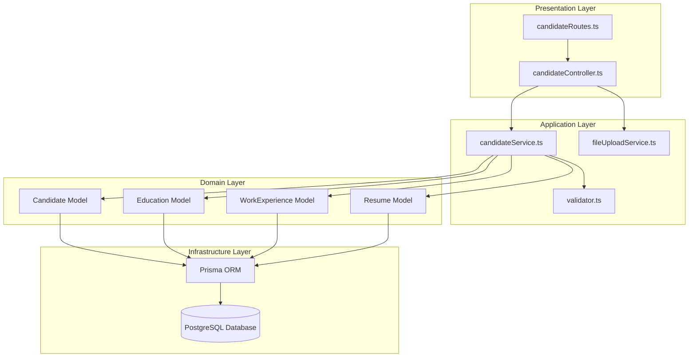
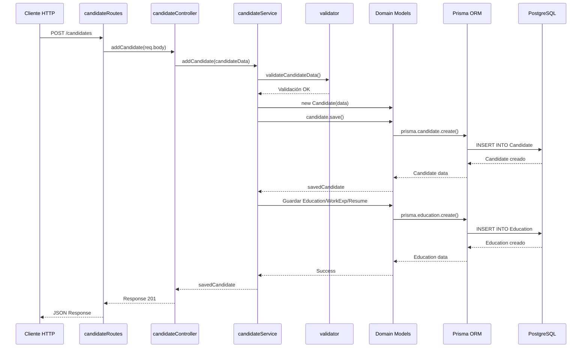
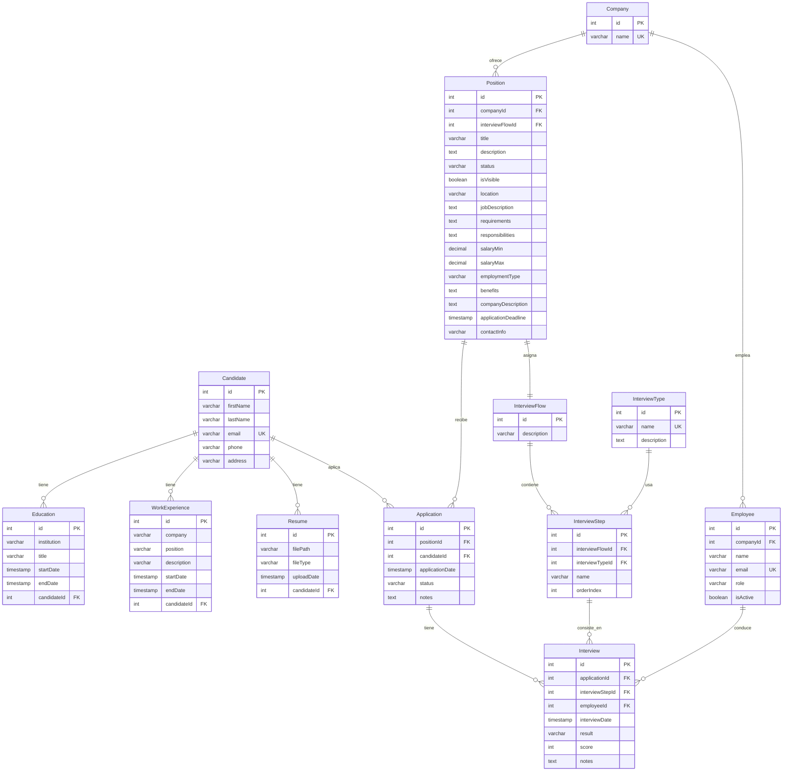
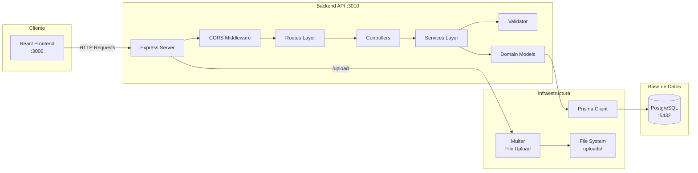
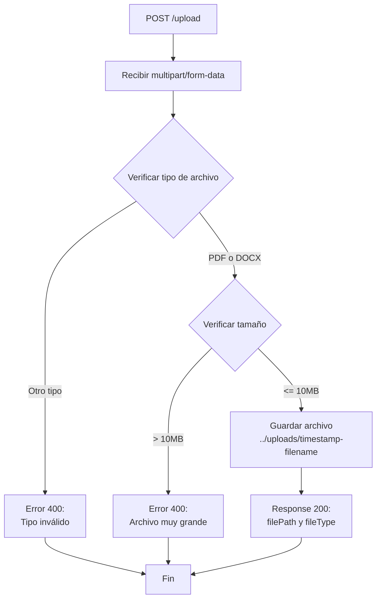
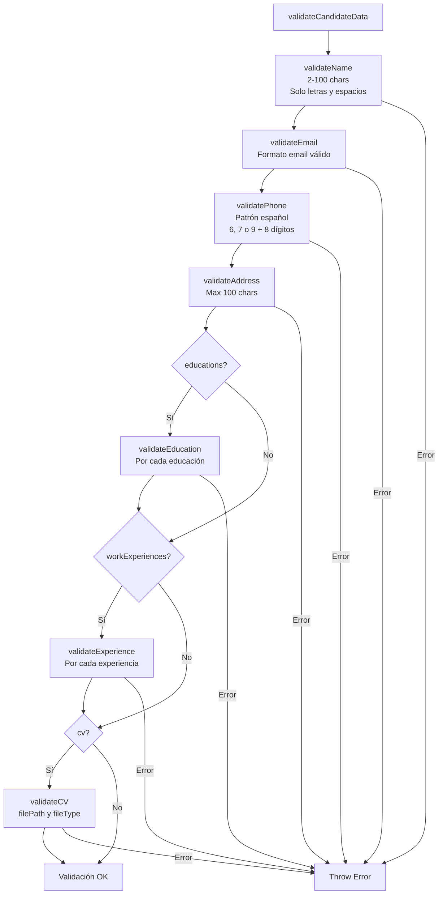
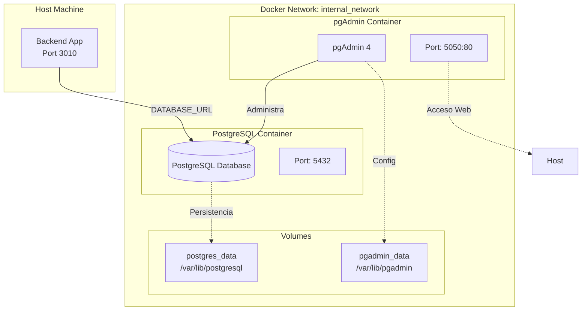

# Análisis del Proyecto - Sistema ATS (Applicant Tracking System)

## 1. Resumen Ejecutivo

Este proyecto es un **Sistema de Seguimiento de Candidatos (ATS - Applicant Tracking System)** desarrollado para gestionar el proceso de reclutamiento. El sistema permite registrar candidatos con su información personal, historial educativo, experiencia laboral y documentos (CVs). 

**Nombre del Proyecto:** LTI - Talent Tracking System  
**Tipo:** Aplicación Full-Stack  
**Arquitectura:** Backend API REST con Frontend React

---

## 2. Stack Tecnológico

### 2.1 Backend

- **Lenguaje:** TypeScript (v4.9.5)
- **Runtime:** Node.js
- **Framework Web:** Express.js (v4.19.2)
- **ORM:** Prisma (v5.13.0)
- **Base de Datos:** PostgreSQL
- **Gestión de Archivos:** Multer (v1.4.5-lts.1)
- **Validación:** Validación personalizada con expresiones regulares
- **Documentación API:** OpenAPI 3.0 (api-spec.yaml)
- **Testing:** Jest (v29.7.0) con ts-jest
- **Herramientas de Desarrollo:**
  - ts-node-dev para desarrollo con hot-reload
  - ESLint + Prettier para linting y formateo
  - dotenv para gestión de variables de entorno

### 2.2 Infraestructura

- **Contenedorización:** Docker Compose
- **Base de Datos:** PostgreSQL (imagen oficial)
- **Herramienta de Administración:** pgAdmin 4 (puerto 5050)
- **Persistencia:** Volúmenes Docker para datos de PostgreSQL y configuración de pgAdmin

### 2.3 Frontend (Referencia)

- **Framework:** React con TypeScript
- **Puerto:** 3000
- **Comunicación:** CORS configurado para permitir requests desde localhost:3000

---

## 3. Arquitectura del Sistema

### 3.1 Patrón Arquitectónico

El proyecto sigue una **Arquitectura en Capas (Layered Architecture)** con separación de responsabilidades:



### 3.2 Estructura de Directorios

```
backend/
├── src/
│   ├── index.ts                      # Punto de entrada de la aplicación
│   ├── domain/                       # Capa de Dominio
│   │   └── models/
│   │       ├── Candidate.ts          # Modelo de dominio Candidate
│   │       ├── Education.ts          # Modelo de dominio Education
│   │       ├── WorkExperience.ts     # Modelo de dominio WorkExperience
│   │       └── Resume.ts             # Modelo de dominio Resume
│   ├── application/                  # Capa de Aplicación
│   │   ├── services/
│   │   │   ├── candidateService.ts   # Lógica de negocio para candidatos
│   │   │   ├── fileUploadService.ts  # Servicio de carga de archivos
│   │   │   └── *.test.ts             # Tests unitarios
│   │   └── validator.ts              # Validaciones de datos
│   ├── presentation/                 # Capa de Presentación
│   │   └── controllers/
│   │       └── candidateController.ts # Controladores HTTP
│   └── routes/                       # Definición de rutas
│       └── candidateRoutes.ts        # Rutas de candidatos
├── prisma/
│   ├── schema.prisma                 # Esquema de base de datos
│   └── migrations/                   # Migraciones de base de datos
├── dist/                             # Código compilado (JavaScript)
├── package.json                      # Dependencias y scripts
├── tsconfig.json                     # Configuración TypeScript
├── jest.config.js                    # Configuración de tests
└── api-spec.yaml                     # Especificación OpenAPI
```

### 3.3 Flujo de Datos



---

## 4. Modelo de Datos (ERD)

### 4.1 Entidades Principales

#### **Candidate** (Candidato)
- **Propósito:** Entidad principal que representa un candidato en el sistema
- **Atributos:**
  - `id` (PK, SERIAL): Identificador único
  - `firstName` (VARCHAR(100)): Nombre
  - `lastName` (VARCHAR(100)): Apellido
  - `email` (VARCHAR(255), UNIQUE): Email (único)
  - `phone` (VARCHAR(15), nullable): Teléfono
  - `address` (VARCHAR(100), nullable): Dirección
- **Índices:**
  - `email` (único)
  - `(lastName, firstName)` (compuesto para búsquedas)

#### **Education** (Educación)
- **Propósito:** Historial educativo del candidato
- **Atributos:**
  - `id` (PK, SERIAL): Identificador único
  - `institution` (VARCHAR(100)): Institución educativa
  - `title` (VARCHAR(250)): Título obtenido
  - `startDate` (TIMESTAMP): Fecha de inicio
  - `endDate` (TIMESTAMP, nullable): Fecha de finalización
  - `candidateId` (FK): Referencia a Candidate
- **Índices:**
  - `candidateId` (FK)
  - `startDate` (para ordenamiento temporal)

#### **WorkExperience** (Experiencia Laboral)
- **Propósito:** Historial laboral del candidato
- **Atributos:**
  - `id` (PK, SERIAL): Identificador único
  - `company` (VARCHAR(100)): Empresa
  - `position` (VARCHAR(100)): Posición/Cargo
  - `description` (VARCHAR(200), nullable): Descripción de responsabilidades
  - `startDate` (TIMESTAMP): Fecha de inicio
  - `endDate` (TIMESTAMP, nullable): Fecha de finalización
  - `candidateId` (FK): Referencia a Candidate
- **Índices:**
  - `candidateId` (FK)
  - `startDate` (para ordenamiento temporal)
  - `company` (para búsquedas por empresa)

#### **Resume** (Currículum)
- **Propósito:** Almacenamiento de archivos CV del candidato
- **Atributos:**
  - `id` (PK, SERIAL): Identificador único
  - `filePath` (VARCHAR(500)): Ruta del archivo
  - `fileType` (VARCHAR(50)): Tipo MIME del archivo
  - `uploadDate` (TIMESTAMP): Fecha de carga
  - `candidateId` (FK): Referencia a Candidate
- **Índices:**
  - `candidateId` (FK)
  - `uploadDate` (para ordenamiento temporal)

#### **Company** (Empresa)
- **Propósito:** Representa las empresas que publican posiciones
- **Atributos:**
  - `id` (PK, SERIAL): Identificador único
  - `name` (VARCHAR(255), UNIQUE): Nombre de la empresa
- **Índices:**
  - `name` (único y para búsquedas)

#### **Employee** (Empleado)
- **Propósito:** Representa empleados de las empresas que pueden conducir entrevistas
- **Atributos:**
  - `id` (PK, SERIAL): Identificador único
  - `companyId` (FK): Referencia a Company
  - `name` (VARCHAR(255)): Nombre del empleado
  - `email` (VARCHAR(255), UNIQUE): Email único
  - `role` (VARCHAR(100)): Rol del empleado
  - `isActive` (BOOLEAN): Estado activo/inactivo
- **Índices:**
  - `companyId` (FK)
  - `email` (único)
  - `isActive` (para filtrar empleados activos)
  - `role` (para búsquedas por rol)

#### **Position** (Posición de Trabajo)
- **Propósito:** Representa las posiciones de trabajo disponibles
- **Atributos:**
  - `id` (PK, SERIAL): Identificador único
  - `companyId` (FK): Referencia a Company
  - `interviewFlowId` (FK): Referencia a InterviewFlow
  - `title` (VARCHAR(255)): Título del puesto
  - `description` (TEXT): Descripción general
  - `status` (VARCHAR(50)): Estado (abierta, cerrada, etc.)
  - `isVisible` (BOOLEAN): Visibilidad pública
  - `location` (VARCHAR(255)): Ubicación
  - `jobDescription` (TEXT): Descripción del trabajo
  - `requirements` (TEXT): Requisitos
  - `responsibilities` (TEXT): Responsabilidades
  - `salaryMin` (DECIMAL(10,2)): Salario mínimo
  - `salaryMax` (DECIMAL(10,2)): Salario máximo
  - `employmentType` (VARCHAR(50)): Tipo de empleo
  - `benefits` (TEXT): Beneficios
  - `companyDescription` (TEXT): Descripción de la empresa
  - `applicationDeadline` (TIMESTAMP): Fecha límite de aplicación
  - `contactInfo` (VARCHAR(500)): Información de contacto
- **Índices:**
  - `companyId` (FK)
  - `interviewFlowId` (FK)
  - `status` (para filtrar por estado)
  - `isVisible` (para filtrar posiciones visibles)
  - `applicationDeadline` (para filtrar por fecha límite)
  - `title` (para búsquedas)

#### **InterviewFlow** (Flujo de Entrevista)
- **Propósito:** Define el flujo de entrevistas para una posición
- **Atributos:**
  - `id` (PK, SERIAL): Identificador único
  - `description` (VARCHAR(500)): Descripción del flujo
- **Índices:**
  - `description` (para búsquedas)

#### **InterviewType** (Tipo de Entrevista)
- **Propósito:** Tipos de entrevistas (técnica, HR, final, etc.)
- **Atributos:**
  - `id` (PK, SERIAL): Identificador único
  - `name` (VARCHAR(100), UNIQUE): Nombre del tipo
  - `description` (TEXT): Descripción
- **Índices:**
  - `name` (único)

#### **InterviewStep** (Paso de Entrevista)
- **Propósito:** Pasos específicos dentro de un flujo de entrevista
- **Atributos:**
  - `id` (PK, SERIAL): Identificador único
  - `interviewFlowId` (FK): Referencia a InterviewFlow
  - `interviewTypeId` (FK): Referencia a InterviewType
  - `name` (VARCHAR(255)): Nombre del paso
  - `orderIndex` (INTEGER): Orden dentro del flujo
- **Índices:**
  - `interviewFlowId` (FK)
  - `interviewTypeId` (FK)
  - `orderIndex` (para ordenamiento)
  - `(interviewFlowId, orderIndex)` (único compuesto)

#### **Application** (Aplicación)
- **Propósito:** Representa las aplicaciones de candidatos a posiciones
- **Atributos:**
  - `id` (PK, SERIAL): Identificador único
  - `positionId` (FK): Referencia a Position
  - `candidateId` (FK): Referencia a Candidate
  - `applicationDate` (TIMESTAMP): Fecha de aplicación
  - `status` (VARCHAR(50)): Estado de la aplicación
  - `notes` (TEXT): Notas adicionales
- **Índices:**
  - `positionId` (FK)
  - `candidateId` (FK)
  - `status` (para filtrar por estado)
  - `applicationDate` (para ordenamiento temporal)
  - `(positionId, candidateId)` (compuesto para evitar duplicados)

#### **Interview** (Entrevista)
- **Propósito:** Representa las entrevistas realizadas
- **Atributos:**
  - `id` (PK, SERIAL): Identificador único
  - `applicationId` (FK): Referencia a Application
  - `interviewStepId` (FK): Referencia a InterviewStep
  - `employeeId` (FK): Referencia a Employee
  - `interviewDate` (TIMESTAMP): Fecha de la entrevista
  - `result` (VARCHAR(50)): Resultado (aprobado, rechazado, pendiente)
  - `score` (INTEGER): Puntuación
  - `notes` (TEXT): Notas de la entrevista
- **Índices:**
  - `applicationId` (FK)
  - `interviewStepId` (FK)
  - `employeeId` (FK)
  - `interviewDate` (para ordenamiento temporal)
  - `result` (para filtrar por resultado)
  - `(applicationId, interviewStepId)` (compuesto para consultas comunes)

### 4.2 Relaciones Completas



**Tipo de Relaciones:**
- **One-to-Many:** 
  - Candidate → Education, WorkExperience, Resume, Application
  - Company → Employee, Position
  - Position → Application
  - InterviewFlow → InterviewStep, Position
  - InterviewType → InterviewStep
  - Application → Interview
  - InterviewStep → Interview
  - Employee → Interview
- **Many-to-One:**
  - Position → InterviewFlow (cada posición tiene un flujo asignado)
- **Foreign Keys:** Todas las relaciones usan `ON DELETE RESTRICT` y `ON UPDATE CASCADE`

### 4.3 Normalización (3NF)

El modelo está normalizado hasta la **Tercera Forma Normal (3NF)**:

1. **1NF (Primera Forma Normal):** Todas las entidades tienen claves primarias y no hay grupos repetitivos
2. **2NF (Segunda Forma Normal):** Todas las entidades dependen completamente de su clave primaria
3. **3NF (Tercera Forma Normal):** No hay dependencias transitivas; todas las entidades dependen directamente de su clave primaria

**Ejemplos de Normalización Aplicada:**
- `InterviewType` está separado de `InterviewStep` para evitar redundancia
- `InterviewFlow` está separado de `Position` para permitir reutilización
- `Company` está separado de `Employee` y `Position` para evitar duplicación de datos

### 4.4 Restricciones y Validaciones

- **Unique Constraints:**
  - `Candidate.email` es único
  - `Company.name` es único
  - `Employee.email` es único
  - `InterviewType.name` es único
  - `InterviewStep(interviewFlowId, orderIndex)` es único (evita pasos duplicados en el mismo orden)
- **Foreign Key Constraints:**
  - Todas las relaciones tienen FKs con `ON DELETE RESTRICT` y `ON UPDATE CASCADE`
  - Esto previene eliminaciones accidentales y mantiene la integridad referencial
- **Índices de Rendimiento:**
  - Índices en todas las claves foráneas para optimizar JOINs
  - Índices en campos frecuentemente consultados (status, dates, emails)
  - Índices compuestos para consultas comunes (positionId + candidateId, applicationId + interviewStepId)
- **Validaciones de Negocio:**
  - Email debe ser único en Candidate y Employee
  - Fechas deben seguir formato YYYY-MM-DD
  - Nombres solo aceptan letras y espacios (incluye caracteres especiales en español)
  - Teléfono debe seguir patrón español (6, 7 o 9 seguido de 8 dígitos)
  - `orderIndex` en InterviewStep debe ser único por InterviewFlow

---

## 5. Operaciones Técnicas

### 5.1 Arquitectura de Componentes



### 5.2 Endpoints de la API

#### **POST /candidates**
- **Descripción:** Crea un nuevo candidato con toda su información
- **Request Body:** JSON con datos del candidato, educaciones, experiencias y CV
- **Response:** 201 Created con datos del candidato creado
- **Validaciones:**
  - Nombres: 2-100 caracteres, solo letras y espacios
  - Email: formato válido, único en la base de datos
  - Teléfono: formato español válido (opcional)
  - Dirección: máximo 100 caracteres (opcional)
  - Fechas: formato YYYY-MM-DD
- **Errores:**
  - 400: Datos inválidos
  - 500: Error del servidor

#### **POST /upload**
- **Descripción:** Sube un archivo (PDF o DOCX) al servidor
- **Request:** multipart/form-data con campo `file`
- **Response:** 200 OK con `filePath` y `fileType`
- **Restricciones:**
  - Tipos permitidos: PDF, DOCX
  - Tamaño máximo: 10MB
- **Errores:**
  - 400: Tipo de archivo inválido
  - 500: Error durante la carga

#### **GET /**
- **Descripción:** Endpoint de salud/verificación
- **Response:** "Hola LTI!"

### 5.3 Servicios de Aplicación

#### **candidateService.ts**
- `addCandidate(candidateData)`: Crea un candidato y sus relaciones
- `getCandidateById(id)`: Obtiene un candidato por ID
- Maneja errores de base de datos (P2002 para emails duplicados)

#### **fileUploadService.ts**
- `uploadFile(req, res)`: Procesa la carga de archivos



- Configuración Multer:
  - Destino: `../uploads/`
  - Nombre: timestamp + nombre original
  - Filtro: solo PDF y DOCX
  - Límite: 10MB

#### **validator.ts**



- Validaciones de datos de entrada:
  - `validateName()`: Nombres y apellidos
  - `validateEmail()`: Formato de email
  - `validatePhone()`: Teléfono español
  - `validateDate()`: Fechas
  - `validateAddress()`: Dirección
  - `validateEducation()`: Datos de educación
  - `validateExperience()`: Datos de experiencia
  - `validateCV()`: Datos de CV
  - `validateCandidateData()`: Validación completa

### 5.4 Modelos de Dominio

Cada modelo de dominio (`Candidate`, `Education`, `WorkExperience`, `Resume`) implementa:

- **Constructor:** Inicializa el objeto desde datos raw
- **save():** Persiste el objeto en la base de datos
  - Si tiene `id`: actualiza registro existente
  - Si no tiene `id`: crea nuevo registro
- **Métodos estáticos:** `Candidate.findOne(id)` para consultas

**Características:**
- Los modelos encapsulan la lógica de persistencia
- Manejo de errores de Prisma (conexión, registros no encontrados)
- Conversión automática de fechas desde strings

### 5.5 Middleware y Configuración

#### **Express Middleware:**
- `express.json()`: Parseo de JSON
- `cors()`: Configurado para `http://localhost:3000`
- Middleware personalizado: Adjunta instancia de Prisma a `req.prisma`
- Middleware de logging: Registra todas las requests
- Error handler: Maneja errores no capturados

#### **Configuración del Servidor:**
- Puerto: 3010
- Variables de entorno: `.env` con `DATABASE_URL`

---

## 6. Base de Datos

### 6.1 Configuración

- **Motor:** PostgreSQL
- **ORM:** Prisma Client
- **Migraciones:** Prisma Migrate
- **Conexión:** Variable de entorno `DATABASE_URL`

### 6.2 Migraciones

- **Sistema:** Prisma Migrate
- **Ubicación:** `prisma/migrations/`
- **Estado:** Migración inicial aplicada (20251116195436_)
- **Lock File:** `migration_lock.toml` para consistencia

### 6.3 Docker Compose



**Servicios:**
1. **db (PostgreSQL)**
   - Imagen: `postgres` (latest)
   - Puerto: Variable `${DB_PORT}` → 5432
   - Volumen: `postgres_data:/var/lib/postgresql`
   - Variables: `POSTGRES_USER`, `POSTGRES_PASSWORD`, `POSTGRES_DB`

2. **pgadmin**
   - Imagen: `dpage/pgadmin4`
   - Puerto: 5050 → 80
   - Volumen: `pgadmin_data:/var/lib/pgadmin`
   - Depende de: `db`

**Red:**
- Red interna `internal_network` (bridge) para comunicación entre servicios

---

## 7. Testing

### 7.1 Configuración

- **Framework:** Jest con ts-jest
- **Configuración:** `jest.config.js`
- **Patrón de archivos:** `*.test.ts` o `*.spec.ts`

### 7.2 Cobertura de Tests

Tests unitarios implementados para:
- `candidateService.test.ts`
- `candidateController.test.ts`
- `validator.test.ts`
- `Education.test.ts`

---

## 8. Seguridad

### 8.1 Implementado

- **Validación de entrada:** Validación exhaustiva de todos los datos
- **CORS:** Configurado para origen específico
- **Validación de archivos:** Tipo y tamaño limitados
- **Manejo de errores:** Errores genéricos para evitar exposición de información sensible

### 8.2 Áreas de Mejora

- Autenticación y autorización (no implementado)
- Rate limiting
- Validación de sanitización de inputs
- HTTPS en producción
- Validación de rutas de archivos para prevenir path traversal

---

## 9. Escalabilidad y Rendimiento

### 9.1 Consideraciones Actuales

- **Base de datos:** PostgreSQL escalable
- **ORM:** Prisma con connection pooling
- **Arquitectura:** Separación de capas facilita escalabilidad horizontal

### 9.2 Limitaciones

- **Archivos:** Almacenamiento local (no escalable)
- **Sin caché:** No hay implementación de caché
- **Sin paginación:** Endpoints no implementan paginación
- **Sin índices adicionales:** Solo índice único en email

---

## 10. Operaciones y Mantenimiento

### 10.1 Scripts Disponibles

```bash
npm start          # Ejecuta versión compilada
npm run dev        # Desarrollo con hot-reload
npm run build      # Compila TypeScript
npm test           # Ejecuta tests
npm run prisma:generate  # Genera Prisma Client
```

### 10.2 Despliegue

1. **Desarrollo:**
   - `docker-compose up -d` para base de datos
   - `npm run dev` para backend
   - `npm run prisma migrate dev` para migraciones

2. **Producción:**
   - `npm run build` para compilar
   - `npm start` para ejecutar
   - Variables de entorno configuradas

### 10.3 Logging

- Logging básico de requests (método, path, timestamp)
- Errores logueados en consola
- Sin sistema de logging estructurado

---

## 11. Documentación

### 11.1 API Documentation

- **OpenAPI Spec:** `api-spec.yaml` con especificación completa
- **Endpoints documentados:** `/candidates` (POST), `/upload` (POST)
- **Swagger UI:** Dependencias instaladas pero no configuradas

### 11.2 Código

- Comentarios mínimos en el código
- Tipos TypeScript proporcionan documentación implícita
- README.md con instrucciones básicas

---

## 12. Análisis de Calidad de Código

### 12.1 Fortalezas

- ✅ Arquitectura en capas bien definida
- ✅ Separación de responsabilidades
- ✅ TypeScript para type safety
- ✅ Validación robusta de datos
- ✅ Manejo de errores estructurado
- ✅ Tests unitarios implementados
- ✅ ORM moderno (Prisma)

### 12.2 Áreas de Mejora

- ⚠️ Duplicación de instancias de PrismaClient en modelos
- ⚠️ Lógica de negocio mezclada en modelos de dominio
- ⚠️ Falta de repositorios/interfaces para abstracción
- ⚠️ Validación de negocio podría estar en la capa de dominio
- ⚠️ Sin DTOs explícitos para transferencia de datos
- ⚠️ Manejo de transacciones no explícito
- ⚠️ Falta de logging estructurado

---

## 13. Conclusiones

### 13.1 Estado Actual

El proyecto presenta una **arquitectura sólida** con separación de capas y uso de tecnologías modernas. El sistema está funcional para un MVP (Minimum Viable Product) de un ATS básico.

### 13.2 Recomendaciones

1. **Arquitectura:**
   - Implementar patrón Repository para abstracción de datos
   - Separar lógica de negocio de modelos de dominio
   - Usar DTOs para transferencia de datos

2. **Base de Datos:**
   - Agregar índices para búsquedas frecuentes
   - Implementar soft deletes si es necesario
   - Considerar paginación en queries

3. **Seguridad:**
   - Implementar autenticación (JWT, OAuth)
   - Agregar rate limiting
   - Validar y sanitizar todas las entradas

4. **Infraestructura:**
   - Migrar almacenamiento de archivos a S3/cloud storage
   - Implementar logging estructurado (Winston, Pino)
   - Configurar Swagger UI para documentación interactiva

5. **Testing:**
   - Aumentar cobertura de tests
   - Agregar tests de integración
   - Implementar tests E2E

6. **Operaciones:**
   - Configurar CI/CD
   - Implementar health checks
   - Agregar métricas y monitoreo

---

**Fecha de Análisis:** 2025  
**Versión del Proyecto:** 1.0.0  
**Analista:** Arquitecto de Software ATS

